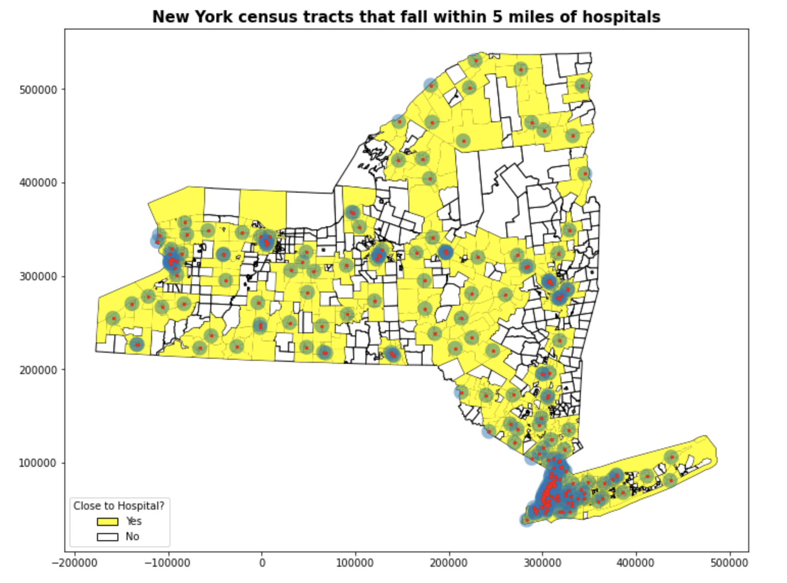
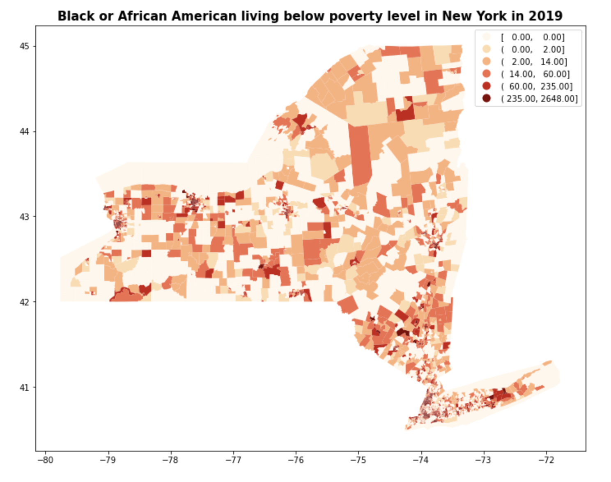

<!-- README.md is generated from README.Rmd. Please edit that file -->

```{r, include = FALSE}
knitr::opts_chunk$set(
  collapse = TRUE,
  comment = "#>"
)
```

#  Geospatial Analysis in Python

<!-- badges: start -->
<!-- badges: end -->

The repository is a collection of instructional documents I created for [NYU Data Services](https://guides.nyu.edu/dataservices) about various topics for geospatial analysis in Python using `geopandas` package. The active link to the files serving on the Data Services website can be found [here](https://guides.nyu.edu/gis/python). 


### GIS in Python: Geocoding
Geocoding in Python allows you to convert tabular datasets that contain geographic information to be mapped and analyzed within GIS software. The example used in this document is to convert a dataset of stops and frisks by New York city police with longitude and latitude to a spatial object and then save it as a shapefile. 

### GIS in Python: Spatial Join
Spatial join is a method to combine information from different shapefiles by using spatial relationships as the join key. The example used in this document is to study which county in California state has the most socioeconomically disadvantaged students by using two shapefiles, a California counties shapefile without the attribute of the number of socioeconomically disadvantaged students and another shapefile of California public school locations supplemented with the schools' demographic information in 2019. 

### GIS in Python: Table Join
Joining Tabular data to a shapefile allows you to add fields from your data table to a shapefile’s attribute table based on matching values found in the key columns, so that you may generate a choropleth map of your variable of interest. The example used in this document is to study which area in New York state has the largest concentration of African Americans living below the poverty level by using two files, a New York state census tracts shapefile without the attribute field for the Black population below the poverty level and a tabular file including the poverty population data at census tract level downloaded from the U.S. Census.

### GIS in Python: Clipping Shapefile
Clipping shapefiles allows you to select certain features and attributes from a layer based on spatial extraction. The example used in this document is to study the distribution of the locations providing seasonal flu vaccinations in Manhattan by creating a shapefile restricted to Manhattan from a map of the locations providing seasonal flu vaccinations throughout New York City.


### GIS in Python: Merging Shapefile
Merging shapefile allows you to combine shapefiles from different sources or different time periods into a single shapefile for analysis. The example used in this document is to study the distribution of outdoor recreational sites owned, operated, funded, licensed or certified by a City, State, or Federal agency in the New York City that helps shape quality of life in the city’s neighborhoods by combining shapefiles of parks, plazas, and historical sites from the City Planning Facilities Database. 

### GIS in Python: Buffering
Buffering allows you to identify or define an area within a specified distance around a feature for spatial analysis or to indicate proximity or accessibility conditions. As we all know, there is a correlation between long ambulance evacuation times and patient death rates. During the COVID-19 pandemic, patients with respiratory emergencies are particularly vulnerable to long evacuations. The example used in this document is to study how many African Americans in New York state live within a 5-mile radius of a hospital and create a map that assists both first responders and African Americans living in New York state in finding the nearest hospital with a 5-mile radius of a medical emergency location by using two shapefiles, a New York state census tract shapefile with an attribute of African Americans population and another shapefile of locations of all the hospitals in New York state. 








