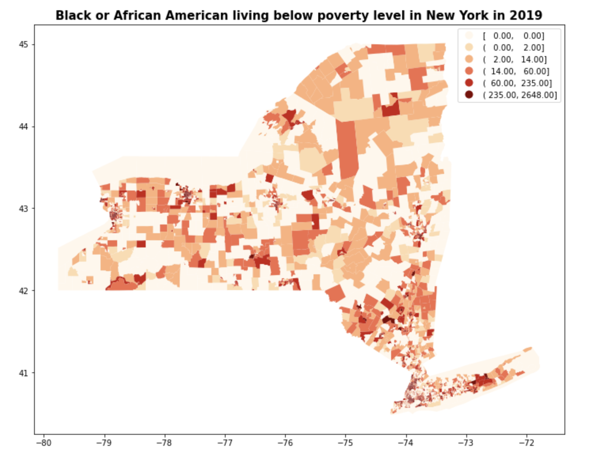

<!-- README.md is generated from README.Rmd. Please edit that file -->

# GIS\_in\_Python

<!-- badges: start -->
<!-- badges: end -->

The repository is a collection of instructional documents I created for
[NYU Data Services](https://guides.nyu.edu/dataservices) about various
topics for geospatial analysis in Python using `geopandas` package. The
active link to the files serving on the Data Services website can be
found [here](https://guides.nyu.edu/gis/python).

### GIS in Python: Geocoding

Geocoding in Python allows you to convert tabular datasets that contain
geographic information to be mapped and analyzed within GIS software.
The example used in this document is to convert a dataset of stops and
frisks by New York city police with longitude and latitude to a spatial
object and then save it as a shapefile.

### GIS in Python: Spatial Join

Spatial join is a method to combine information from different
shapefiles by using spatial relationships as the join key. The example
used in this document is to study which county in California state has
the most socioeconomically disadvantaged students by using two
shapefiles, a California counties shapefile without the attribute of the
number of socioeconomically disadvantaged students and another shapefile
of California public school locations supplemented with the schools’
demographic information in 2019.

### GIS in Python: Table Join

Joining Tabular data to a shapefile allows you to add fields from your
data table to a shapefile’s attribute table based on matching values
found in the key columns, so that you may generate a choropleth map of
your variable of interest. The example used in this document is to study
which area in New York state has the largest concentration of African
Americans living below the poverty level by using two files, a New York
state census tracts shapefile without the attribute field for the Black
population below the poverty level and a tabular file including the
poverty population data at census tract level downloaded from the U.S.
Census.

### GIS in Python: Clipping Shapefile

Clipping shapefiles allows you to select certain features and attributes
from a layer based on spatial extraction. The example used in this
document is to study the distribution of the locations providing
seasonal flu vaccinations in Manhattan by creating a shapefile
restricted to Manhattan from a map of the locations providing seasonal
flu vaccinations throughout New York City.

### GIS in Python: Merging Shapefile

Merging shapefile allows you to combine shapefiles from different
sources or different time periods into a single shapefile for analysis.
The example used in this document is to study the distribution of
outdoor recreational sites owned, operated, funded, licensed or
certified by a City, State, or Federal agency in the New York City that
helps shape quality of life in the city’s neighborhoods by combining
shapefiles of parks, plazas, and historical sites from the City Planning
Facilities Database.

### GIS in Python: Buffering

Buffering allows you to identify or define an area within a specified
distance around a feature for spatial analysis or to indicate proximity
or accessibility conditions. As we all know, there is a correlation
between long ambulance evacuation times and patient death rates. During
the COVID-19 pandemic, patients with respiratory emergencies are
particularly vulnerable to long evacuations. The example used in this
document is to study how many African Americans in New York state live
within a 5-mile radius of a hospital and create a map that assists both
first responders and African Americans living in New York state in
finding the nearest hospital with a 5-mile radius of a medical emergency
location by using two shapefiles, a New York state census tract
shapefile with an attribute of African Americans population and another
shapefile of locations of all the hospitals in New York state.

